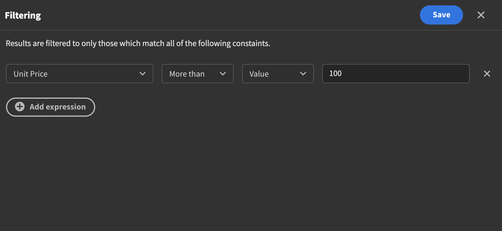
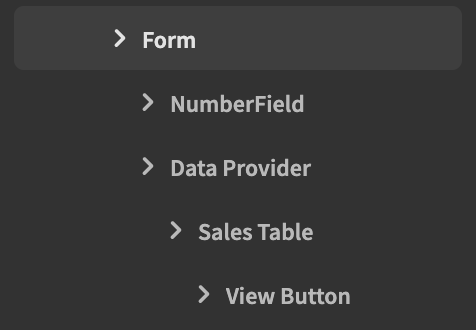

# Search/Filter Data

### Static Filtering

Once you have added a data source to your dataprovider component you can access the filter drawer by simply clicking on it. In the drawer that comes up you can add an expression. This is where you select a column you want to filter on. Let's say you wanted to filter out all rows with a price greater than 100 - you would select the appropriate column, select "More than", "value" and then type in 100. You are not limited to just one expression, you can add as many as you like. 

### Filtering data from the front-end

Often you will find yourself wanting to let the user filter the data on the front-end. This can be achieved as well but requires a bit more work. To get started you will need a `Form` component. Select the schema you want, most often it will be the same thing you select in the data provider. Inside the form, put a `Data Provider` component as well as a field of your choice, an easy one to get started with is the `Number Field`. On the field component you select the column you want to filter on. In the example below we'll use the unit price.

In the data provider, select the define filters button. Next add an expression and select the same `Unit Price` that you selected for the number field component, "More than" and "Binding". Select the lightning bolt icon to the right and select the number field from the list of bindings that comes up. After saving your users should now be able to filter the data themselves.

### Video tutorial with two option pickers



