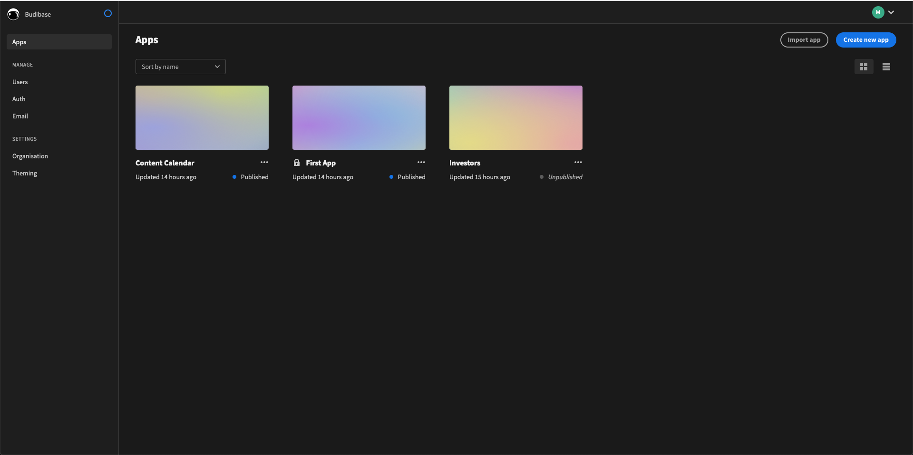
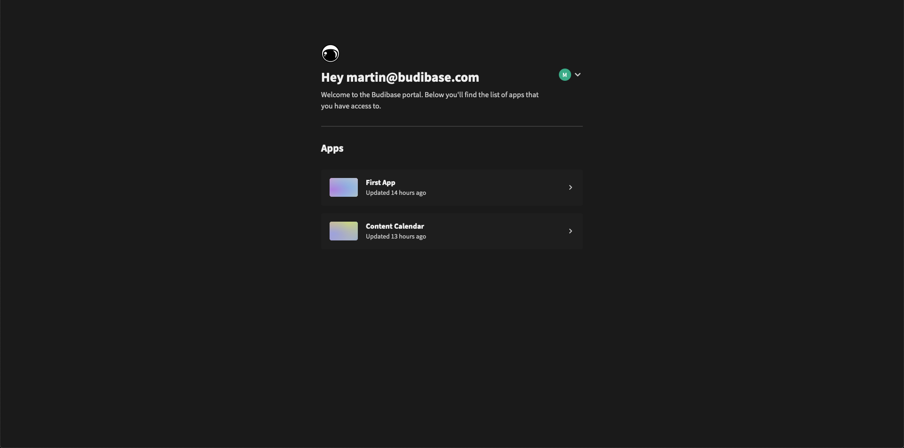

# The Budibase Portal

When you sign in to budibase, you will be presented with the budibase portal. Depending on your user role, you will see either the **admin portal**, **development portal** or the **standard portal.**

### Admin Portal

Admin users have access to all of the functions of the budibase portal, such as user and OAuth administration, email templates and organisation level settings. Admins can also build, deploy and manage applications.

See the **Admin** section of the docs to find out more about the different admin features of budibase!

### Development Portal

Developers can build, deploy and manage applications. They do not have access to any of the admin configuration sections of the portal. 

### Standard Portal

In the standard portal. You can only see the list of deployed applications that you have access to. You will not see the user administration options, dev apps or deployment options that are available in development or admin mode. The standard portal acts as a landing page or dashboard for users to use budibase apps created by builder users.

