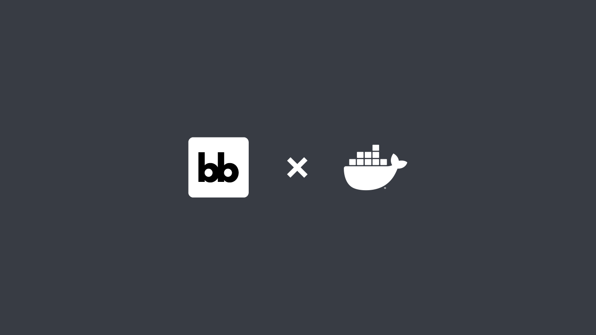
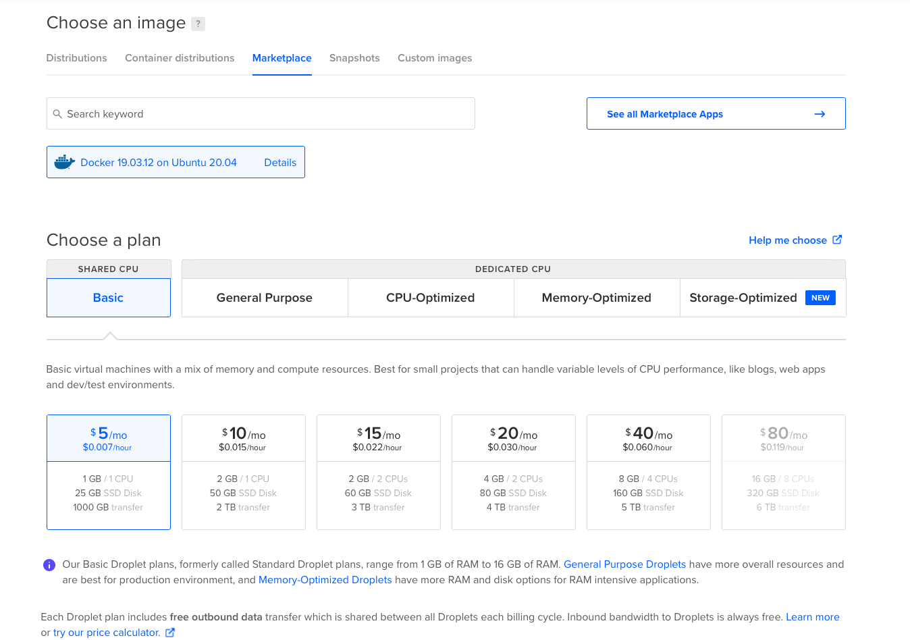
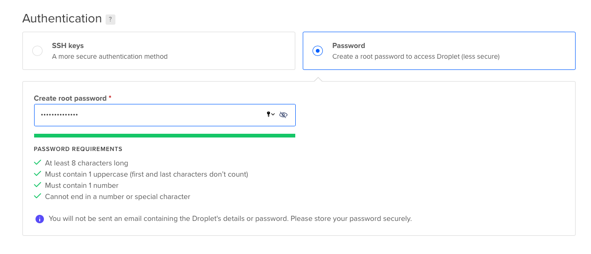

# Introduction to self hosting

Budibase wants to make sure anyone can use the tools we develop and we know a lot of people need to be able to host the apps they make on their own systems - that is why we've decided to try and make self-hosting as easy as possible!



Budibase currently supports hosting of our platform through the use of [Docker](https://www.docker.com/) and an orchestration tool called [Docker Compose](https://docs.docker.com/compose/). With these tools it is possible to get Budibase up and running anywhere in only a few minutes! Follow the links below to find out more and get the full details on how to get this setup.

## Simple Setup

The simplest way to get self-hosted budibase up and running quickly is to use [DigitalOcean](https://www.digitalocean.com). Create an account if you don't have one. You can also use our [referral code](https://m.do.co/c/0caaa6085a82) to get $100 of free DigitalOcean credit!

Follow these steps to set up your budibase instance:

### Create a Docker Droplet

We use [Docker](https://www.docker.com/) and [Docker Compose](https://docs.docker.com/compose/install/) to run budibase. DigitalOcean provides a droplet \(server\) pre-configured with both. Create a docker droplet here:

[https://marketplace.digitalocean.com/apps/docker](https://marketplace.digitalocean.com/apps/docker)

Click **Create Docker Droplet** to get to the configuration screen.

### Set Up Droplet

Now it's time to configure your droplet.



The smallest droplet \(1GB\) will run the platform well, but we recommend larger instances for higher volume use cases.

Choose where you would like to host your droplet by clicking on one of the flags in the datacenter region section, or leave as default to host in New York.

Next, we need to paste our userdata into the relevant area. Userdata is a script that runs to configure our budibase instance when it boots. All you need to do is click the "User data" checkbox under **Additional Options**, and paste the following:

```bash
#!/bin/bash

curl -o- https://raw.githubusercontent.com/Budibase/budibase/master/hosting/bootstrap.sh | bash
```

Your setup should look like this:


Now, create a password for your instance. This allows you to access your instance later on.



Finally, click the **Create Droplet** button at the bottom. This will bring up your shiny new budibase instance, and you can now [configure your builder](builder-settings.md) to deploy your budibase applications to your new instance!

### Video

If you are more of a visual person, here's an instructional video showing how to perform the above simple DigitalOcean installation.



## Hosting Configuration

We do not recommend the simple digitalocean setup alone for production installations. The following sections detail how you can edit your budibase configuration, or spin up budibase manually on your own servers.

1. [Hosting methods](hosting-methods/) - different ways that you can host the Budibase platform
2. [Hosting settings](hosting-settings.md) - important settings for your hosted cluster
3. [Builder settings](builder-settings.md) - how to setup your builder to use the hosted cluster
4. [Advanced options](advanced-options/) - information about things such as setting up TLS, proxy requests through your own domain and so on

We also want to keep making it easier to use the Budibase platform and for this reason we will continue to add support for new tools and frameworks so that whatever your use case we will have you covered. We'd love to hear if there is something you'd like to see us support, below are a list of tools that we are considering building native support for and where you can add your thoughts to the conversation:

1. [Kubernetes support](https://github.com/Budibase/budibase/discussions/984)
2. [AWS support](https://github.com/Budibase/budibase/discussions/986)
3. [Azure support](https://github.com/Budibase/budibase/discussions/987)
4. [GCP support](https://github.com/Budibase/budibase/discussions/988)

Also if you want to suggest something that hasn't been mentioned here we'd love to hear about it, the best way to tell us about your use case is through [Github Discussions](https://github.com/Budibase/budibase/discussions) - just open a new discussion and let us know!

