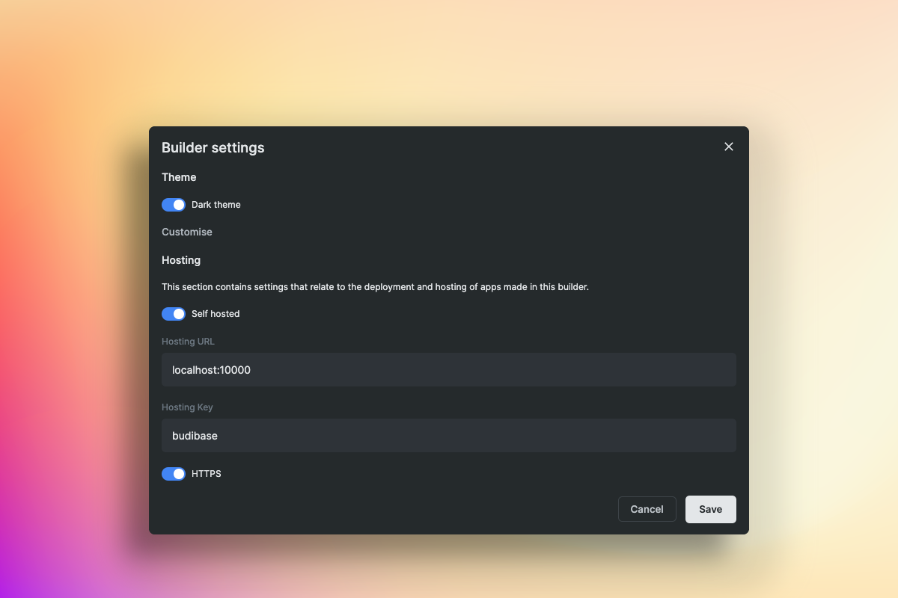

# Introduction to self hosting

Budibase wants to make sure anyone can use the tools we develop and we know a lot of people need to be able to host the apps they make on their own systems - that is why we've decided to try and make self-hosting as easy as possible!

Budibase currently supports hosting of our platform through the use of [Docker](https://www.docker.com/) and an orchestration tool called [Docker Compose](https://docs.docker.com/compose/). The easiest way to get started with self-hosting budibase is to host using a [Docker Droplet on DigitalOcean](hosting-methods/digitalocean.md). With these tools it is possible to get Budibase up and running anywhere in only a few minutes! Follow the links below to find out more and get the full details on hosting and configuration options for the budibase platform.

1. [Hosting methods](hosting-methods/) - different ways that you can host the Budibase platform.
2. [Hosting settings](hosting-settings.md) - important settings for your hosted cluster
3. [Builder settings](builder-settings.md) - how to setup your builder to use the hosted cluster
4. [Advanced options](advanced-options/) - information about things such as setting up TLS, proxy requests through your own domain and so on

We also want to keep making it easier to use the Budibase platform and for this reason we will continue to add support for new tools and frameworks so that whatever your use case we will have you covered. We'd love to hear if there is something you'd like to see us support, below are a list of tools that we are considering building native support for and where you can add your thoughts to the conversation:

1. [Kubernetes support](https://github.com/Budibase/budibase/discussions/984)
2. [AWS support](https://github.com/Budibase/budibase/discussions/986)
3. [Azure support](https://github.com/Budibase/budibase/discussions/987)
4. [GCP support](https://github.com/Budibase/budibase/discussions/988)

Also if you want to suggest something that hasn't been mentioned here we'd love to hear about it, the best way to tell us about your use case is through [Github Discussions](https://github.com/Budibase/budibase/discussions) - just open a new discussion and let us know!

