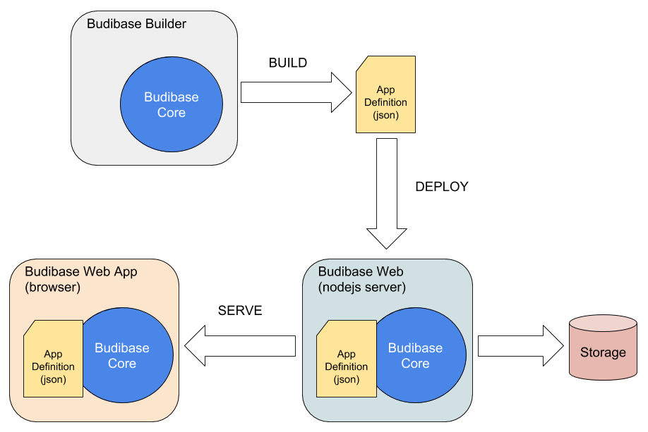
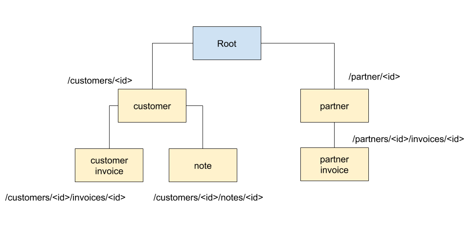

# Budibase Core

Budibase Core is a library used by Budibase Apps, Budibase Server and Budibase Builder. It defines and implements all Core APIs used in Budibase. Its main purpose is to construct and to understand the "Budibase App Definition".

Here is a quick overview of the usage of Budibase Core:

1. Budibase Builder is used to create an "App Definition" - a set of JSON files that defines everything about an app built with Budibase. The builder is really just a User Interface that wraps Budibase Core. Budibase Core defines the APIs used to construct an App Definition.
2. Budibase Web provides and HTTP API for your web app to use. All HTTP Endpoints and behaviours are defined by the App Definition file. Budibase Core implements the behaviour of these endpoints \(except for any custom endpoints\). Budibase Web is really just an HTTP wrapper around Budibase Core.
3. Your Budibase App's front end presents your app's data, and makes HTTP requests to Budibase Web. Budibase Core is used in your app to understand the App Definition. It allows record/field binding, running validation rules, knowledge of security levels.

## Concepts

### Records

A record is the fundamental unit of data in Budibase. Records are stored as JSON. A record has a schema, that is defined in the app definition. The record's schema will define:

1. Fields. Every field must be declared, and will consist of
   * Name. e.g. "last\_name". This is the name of the member, as stored in JSON
   * Label. e.g. "Last Name". What the field will be labelled as in the user interface
   * Type. e.g. "string". Types are listed below
   * TypeOptions. See types below
   * InitialValue. e.g. "\(unknown\)". The initial value on a new record 
   * DefaultValue. e.g. "\(not set\)". The value taken if the loaded JSON object is missing this field
2. Validation Rules. A set of rules, written in javascript, which are run when a record is created or updated
3. Collection Name. This defines the "key" \(and therefore URL\) of the record. e.g. "customers", may cause a record to have a key of "/**customers**/0-6shd8uu""
4. Record Node Id. Each record type will have its own unique integer. this is used to for the record's key. e.g. "/customer/**0**-6shd8uu".
5. Collection Sharding. This defines how a collection of records of this type are stored. At the storage level, all records belong to a "folder". Sharding enables records to be stored across multiple folders, to aid scalability
6. Children. A record may have child records. E.g. "Invoice" may belong to "Customer". See "Hierarchy" below
7. Indexes. Used to keep a retrievable list of the record's decendants \(children, grandchildren etc...\). See "Indexes" below

A Budibase record will always have a "key" member. The key is used to determine the record's type, and thus its schema.

**Hierarchy**

Your database schemas are organised in a tree structure. Each node, except for the root, is a record node.

Below shows an example hierarchy:

In this example, the "customer invoice" node is a child of "customer". Thus, records of this type will always have a key in the format:

`/customers/{parent customer id}/invoices/{invoice id}`

### Indexes

An index is the only way to retrieve collections of records, i.e. a JSON array of records. When a record is created, updated or deleted, an index is updated.

Indexes may belong to the root node, or to any record node.

An index is defined with the following properties:

* `name`. This will define the key of the index, i.e. the path used to access it. For example, "all\_invoices" index on the customer node will have a key in the format "/customers/{customer-id}/all\_invoices". Required
* `map`. As in "map-reduce". Javascript code, used to determine which fields are selected from the record, into the index. Not required - defaults to all fields
* `filter`. A Javascript function, which should return a bool. Determines whether a record should b included in the index. Not required
* `allowedRecordNodeIds`. An array of record node IDs to include in the index. Required

An index may be either be of type "hierarchal" or "reference".

**Hierarchal Index.**

When a record is changed, Budibase Core will search for all hierarchal indexes \(type='hierarchy'\) that belong to an ancestor of the record. For each found it then applies the following rules:

1. Check if record's node ID is included in the index's allowedRecordNodeIds
2. Run the filter method
3. Determine if index should be updated:
   * If creating and filter returns true: add to index
   * if deleting and filter returns true: remove from index
   * if updating, filter returns true, filter previously returned true & mapped record has changed: update in index
   * if updating, filter returns false & filter previously returned true: remove from index
   * if updating, filter returns true & filter previously returned false: add to index

**Reference Index**

A reference index is used when a record has a field of type reference, i.e. when one record references another record.

If record A references record B, then record B will hold an index, which includes record A, and any other records that are referencing it.

#### Field Types

| Type | Description |
| :--- | :--- |
| string |  |
| bool |  |
| datetime |  |
| number |  |
| reference | reference to another record |
| array \(typed\) | an array, containing only values of one of the above types |
|  |  |

#### Datastore

The datastore is a Budibase abstraction, describing a set of methods used to read and write data to the end storage mechanism.

The actual implementation of the datastore is passed to the Budibase Core, from whatever is using the library. In general, the Budibase datastore is a key-value store. Any store of data that allows for a "key" \(id\) and a "value" \(json data\) can have a Budibase datastore written. In Budibase Core the "key" is referred to as "key", and the "value" is referred to as either:

* "File": When data \(e.g. a record or index\) is being stored
* "Folder": Used to keep a list of files in this namespace \(i.e. just like a folder or directory in a file system\)

Some examples of potential datastore implementations:

* In Memory. The Budibase Core test suite uses a a JSON object as it's datastore. Each member of the JSON object represents the key and value
* File system. File/Folder path = key, File/Folder contents  = value
* Redis. Is a key value store
* MongoDb. Keys and Documents
* Dropbox. Same as filesystem

### Behaviours

Behaviours are how we write custom backend code for Budibase. A behaviour

* Is a javascript function, that takes one argument
* Lives inside a javascript module. We refer to this module as a "Behaviour Source"
* Behaviour sources are passed into Budibase Core when the library is initialised

Your behaviour source will be imported into your Budibase backend.

### Actions

Actions are how you integrate custom backend code into your Budibase application. Actions are used to run behaviours. Actions have the following properties:

* Name. Should be unique. It is how your action is identified and called. In Budibase Web, your action will be callable via a url in the format `POST /api/actions/<action name>`
* Behaviour Source. The name of the javascript module that the behaviour resides in
* Behaviour Name. The name of the behaviour to run
* Initial Options. A default argument for the behaviour. The caller of the action can supply partially completed arguments, which will be completed by these Initial Options

### Triggers

Triggers are used to automatically run actions, after certain application events. A full list of applications events can be found in [https://github.com/Budibase/budibase-core/blob/master/src/common/events.js](https://github.com/Budibase/budibase-core/blob/master/src/common/events.js)

Triggers have the following properties:

* Action Name. The action to run
* Event Name. The event that will trigger the action
* Condition. A javascript expression, used to determine whether the action should be run or not
* Options Creator. A javascript expression used to create the behaviour "options" i.e. the argument to the behaviour

## Runtime Responsibilities

On the web server:

* Validates incoming web requests, using schema and rules defined in the application definition
* Authenticates and authorizes incoming requests, using access levels defined in the app definition
* Stores records
* Handles record retrieval from storage
* Manages indexing of records, on create, update and delete. Indexes are defined in the app definition
* Manages users and their levels of access. Users are stored in storage. Allowed access levels are defined in the app definition.

In the application frontend \(browser\):

* Automatically binds UI controls to records, using schema defined in the app definition
* Disables/Enables features and actions in the UI, based on a user's access levels
* Knows which fields are available on indexes, for searching and displaying of collections of data records
* When a record is created/updated/deleted, knows which indexes should change, and can update views accordingly without having to refetch an index.

## API

Budibase Core is divided into five APIs.

* [Record API](https://github.com/Budibase/budibase-core/blob/master/src/recordApi/index.js). For all CRUD operations on records
* [Index API](https://github.com/Budibase/budibase-core/blob/master/src/indexApi/index.js). For listing contents and searching indexes
* [Auth API](https://github.com/Budibase/budibase-core/blob/master/src/authApi/index.js). For user authentication and authorisation
* [Collection API](https://github.com/Budibase/budibase-core/blob/master/src/collectionApi/index.js). For iterating through all records in a collection \(mainly used for rebuilding indexes\)
* [Template API](https://github.com/Budibase/budibase-core/blob/master/src/templateApi/index.js). For constucting the Budibase App Definition

