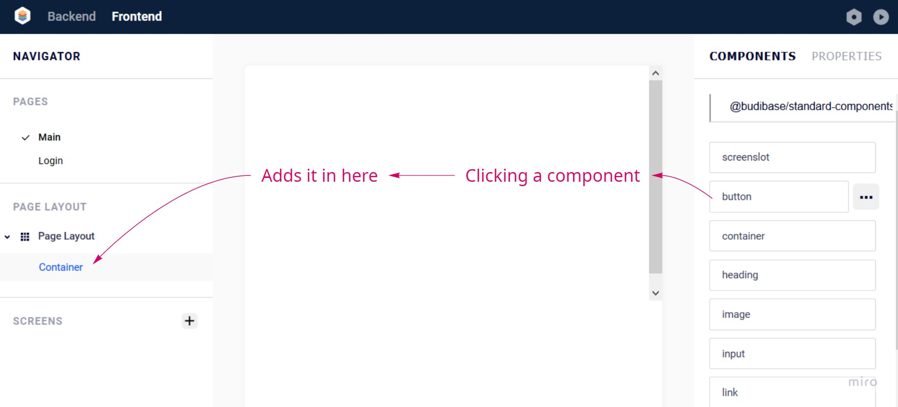

# Adding Components

Budibase frontends are put together using "Components". A component can be as simple as a block of text, or a button. But, it can also be as complex as a Calendar or a Kanban Board.

## Clown School Design

This is the page layout that we will try to create:

So, we are going to add:

* A header bar, containing
  * A logo
  * 2 links
* A place to put the current content

## Adding Components

To create our header, we will first add a "Container" component. When we click the component, it will get added to our component list, under Page Layout:

Once the container is added, we can add components into the container. Click on your container, under Page Layout, then choose another component from the panel on the right side of the screen.

For Clown School, we will end up with:

When we choose a component that we have added, we can edit its properties from the "Properties" panel on the right side of the app.

